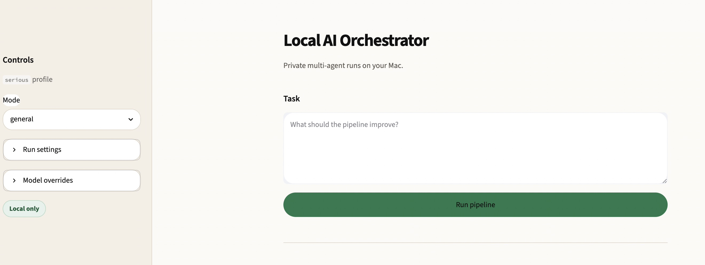
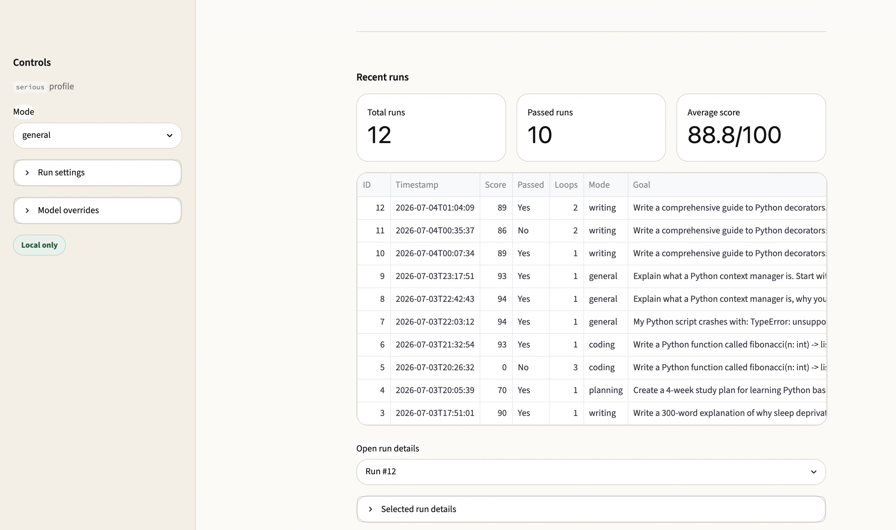
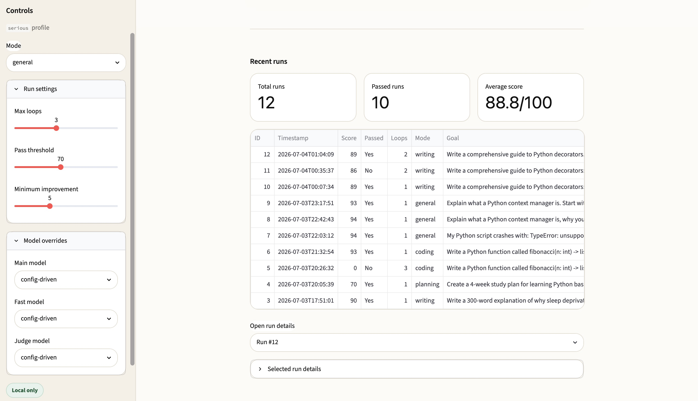

# Local AI Orchestrator

> A local-first, free-to-run multi-agent AI pipeline that improves outputs
> through structured critique, revision, scoring, code verification, and final synthesis.
> Runs on a MacBook Pro with no paid APIs. No internet connection required after setup.

---

## The Problem

Single-call AI responses are inconsistent. You send one prompt, get one answer,
and have no way to know whether it is the best possible output or a mediocre first
draft. Large AI companies solve this with internal feedback loops and verification
systems — but those systems are usually invisible to users and often depend on
paid API calls.

This project brings that quality loop to a local machine: one goal in, multiple
agent passes, critique, revision, scored judgment, optional code verification,
and a polished final output — all running locally through Ollama.

---

## Features

- **7-agent quality pipeline**: Supervisor → Planner → Builder → Critic →
  Fixer → Judge → Synthesizer
- **Scored improvement loop**: Output improves across up to N iterations until
  it passes a configurable quality threshold
- **Structured JSON scoring**: The Judge returns category scores, pass/fail,
  hard failures, and rationale
- **Workflow modes**: Writing, Coding, Planning, Debugging, Study, and General
- **Real code verification**: In coding mode, generated Python is executed and
  pytest tests are run; failures are fed back into the next loop
- **Hard-fail safety for broken code**: Code that fails execution or pytest cannot
  pass just because the Judge model scored it highly
- **Streamlit dashboard**: Local web UI with live agent output, score progression,
  model controls, final output display, and run history
- **SQLite run history**: Runs and iterations are saved locally for later review
- **Structured logging**: JSON logs are written for debugging and run inspection
- **Config-driven models**: Change model profiles without editing agent code
- **Provider-ready adapter layer**: Ollama is the default; OpenAI and Anthropic
  stubs exist for future expansion
- **Fully local by default**: No API keys, no subscription, no paid model calls

---

## Architecture

```text
User Goal
    │
    ▼
┌─────────────┐
│ Supervisor  │  Refines goal and chooses workflow mode
└──────┬──────┘
       │
       ▼
┌─────────────┐
│  Planner    │  Creates a structured execution plan
└──────┬──────┘
       │
       ▼
┌─────────────┐
│  Builder    │  Produces the first complete draft
└──────┬──────┘
       │
       ▼
┌─────────────────────────────────────────────┐
│              Improvement Loop               │
│                                             │
│  ┌─────────┐   ┌────────┐   ┌──────────┐   │
│  │ Critic  │ → │ Fixer  │ → │ Verify*  │   │
│  └─────────┘   └────────┘   └────┬─────┘   │
│                                  │         │
│                              ┌───▼───┐     │
│                              │ Judge │     │
│                              └───┬───┘     │
│                                  │         │
│      repeat if score is below threshold     │
└─────────────────────────────────────────────┘
       │
       ▼
┌─────────────┐
│ Synthesizer │  Polishes the best-scoring draft
└─────────────┘
```

`Verify` runs only in coding mode. It extracts Python code, executes it safely,
runs pytest when tests exist, and feeds failures back into the next revision loop.

---

## Agent Roles

### Supervisor

The Supervisor receives the raw goal, rewrites it into a cleaner task, and chooses
the workflow mode.

### Planner

The Planner converts the refined goal into a structured plan for the Builder.

### Builder

The Builder creates the first complete draft or implementation.

### Critic

The Critic reviews the draft and identifies weaknesses, missing pieces, errors,
or unclear sections.

### Fixer

The Fixer revises the draft based on the Critic’s feedback.

### Code Verifier

In coding mode, the verifier extracts Python code blocks, blocks unsafe patterns,
runs the code, and runs pytest tests when present.

### Judge

The Judge scores the revised draft and returns structured JSON containing the score,
pass/fail decision, hard failures, and rationale.

### Synthesizer

The Synthesizer takes the best-scoring draft and produces the final polished output.

---

## Repository Structure

```text
local-ai-orchestrator/
├── agents/
│   ├── supervisor.py
│   ├── planner.py
│   ├── builder.py
│   ├── critic.py
│   ├── fixer.py
│   ├── judge.py
│   └── synthesizer.py
├── app/
│   └── streamlit_app.py
├── config/
│   ├── models.yaml
│   └── modes.yaml
├── orchestrator/
│   ├── adapters.py
│   ├── code_runner.py
│   ├── config_loader.py
│   ├── database.py
│   ├── logger.py
│   └── pytest_runner.py
├── prompts/
│   ├── supervisor.txt
│   ├── planner.txt
│   ├── builder.txt
│   ├── critic.txt
│   ├── fixer.txt
│   ├── judge.txt
│   └── synthesizer.txt
├── runs/
│   └── .gitkeep
├── logs/
│   └── .gitkeep
├── run.py
├── run_langgraph.py
├── show_history.py
├── activate.sh
├── requirements.txt
└── README.md
```

Generated run folders, SQLite history, logs, virtual environments, and environment
files are ignored by Git.

---

## Requirements

This project was built and tested on:

- macOS
- Apple Silicon MacBook Pro
- 24GB unified memory
- Python 3.14
- Ollama
- Streamlit
- SQLite
- Local open-weight models

Recommended Ollama models:

```bash
ollama pull llama3.2:3b
ollama pull llama3.1:8b
ollama pull qwen2.5:14b
ollama pull qwen2.5-coder:14b
ollama pull gemma3:12b
ollama pull phi4:14b
```

The system can run with smaller models for faster testing.

---

## Setup

Clone the repository:

```bash
git clone https://github.com/andyyaro/local-ai-orchestrator.git
cd local-ai-orchestrator
```

Create and activate the virtual environment:

```bash
python3 -m venv .venv
source .venv/bin/activate
```

Install dependencies:

```bash
pip install -r requirements.txt
```

Make sure Ollama is running:

```bash
curl http://localhost:11434
```

Expected output:

```text
Ollama is running
```

Optional helper activation script:

```bash
source activate.sh
```

---

## Terminal Usage

Run the terminal pipeline:

```bash
python run.py \
  --goal "Write a 300-word explanation of why sleep deprivation hurts productivity." \
  --max-loops 2 \
  --threshold 65
```

Example coding run:

```bash
python run.py \
  --goal "Write a Python function called fibonacci(n: int) -> list[int] that returns the first n Fibonacci numbers. Include pytest tests for n=0, n=1, and n=10." \
  --model-main qwen2.5-coder:14b \
  --model-fast llama3.2:3b \
  --max-loops 3 \
  --threshold 70
```

Example stress run with lighter models:

```bash
python run.py \
  --goal "Write a comprehensive guide to Python decorators: what they are, how they work, three practical examples, and when not to use them." \
  --model-main llama3.1:8b \
  --model-fast llama3.2:3b \
  --max-loops 4 \
  --threshold 88 \
  --min-improvement 2
```

Each run creates a folder under `runs/<timestamp>/` containing intermediate
artifacts such as:

```text
00_supervisor.json
01_planner_plan.txt
02_builder_draft_v0.txt
loop01_critic.txt
loop01_fixer.txt
loop01_judge.json
best_draft.txt
final_output.txt
run_summary.json
```

In coding mode, code verification artifacts are saved as:

```text
loop01_code_run.txt
```

---

## Streamlit Dashboard

Launch the local dashboard:

```bash
streamlit run app/streamlit_app.py
```

Then open:

```text
http://localhost:8501
```

The dashboard lets you:

- Enter a goal
- Select workflow mode
- Choose model overrides
- Set loop count and score threshold
- Watch agent outputs live
- See score progression
- Download the final output
- Browse run history from SQLite

---

## Run History

Runs are saved locally in SQLite:

```text
runs/history.db
```

Inspect recent runs from the terminal:

```bash
python show_history.py
```

Show database stats:

```bash
python show_history.py --stats
```

Inspect a specific run:

```bash
python show_history.py --run-id 1
```

Reset run history:

```bash
python show_history.py --reset
```

The database is intentionally ignored by Git because it contains personal run data.

---

## Configuration

Model behavior is controlled by:

```text
config/models.yaml
```

Switch between profiles by changing:

```yaml
active_profile: serious
```

Available profiles include:

```text
bootstrap
fast
serious
coding
```

Workflow behavior is controlled by:

```text
config/modes.yaml
```

Prompts are stored in:

```text
prompts/
```

This makes it possible to improve agent behavior without rewriting the main pipeline.

---

## Code Verification

Coding mode includes real execution checks.

The verifier:

1. Extracts Python fenced code blocks.
2. Blocks dangerous patterns.
3. Runs the extracted Python code.
4. Runs pytest if test functions are present.
5. Marks the iteration as failed if execution or tests fail.
6. Feeds the verification output into the next Critic/Fixer loop.

A Judge pass cannot override broken code. If code verification fails, the verdict is
forced to a `broken_code` hard failure.

---

## Logging

Structured pipeline logs are written to:

```text
logs/pipeline.log
```

Each log entry is JSON and includes events such as:

```text
run_start
agent_start
agent_end
score
code_verification
run_stop
error
```

The log file is ignored by Git.

---

## Testing Status

The full system was tested with six end-to-end scenarios:

```text
✅ Writing test
✅ Planning test
✅ Coding test with pytest verification
✅ Debugging test
✅ Study/explanation test
✅ Stress test with multiple loops
```

The stress test verified that the system can run multiple improvement loops,
track score progression, save the highest-scoring draft, and complete while memory
pressure stays green.

---

## Screenshots

### Minimal Streamlit dashboard



### Run controls and local model settings



### Run history and output review



## Limitations

- Local model quality depends on the selected Ollama model.
- 14B models can be slow on long prompts.
- Large models may timeout on memory-heavy runs.
- Code verification executes generated code locally, so safety rules matter.
- The Judge score is model-dependent and may not be perfectly calibrated.
- This is a single-user local system, not a hosted multi-user product.

---

## Safety Notes

- The project runs locally by default.
- No data is sent to paid APIs by default.
- `.env`, `.venv/`, `runs/`, and `logs/` are ignored by Git.
- Never commit API keys, tokens, passwords, or local run databases.
- Review generated code before trusting it outside the sandboxed verification flow.

---

## Planned Improvements

- [ ] Add dashboard screenshots to the README
- [ ] Add a visual diff between Fixer iterations
- [ ] Add export buttons for Markdown and PDF
- [ ] Add run comparison view
- [ ] Add RAG over previous runs or local documents
- [ ] Add optional OpenAI or Anthropic provider support through config
- [ ] Add more detailed model-performance benchmarking

---

## License

MIT License.

---

Built with Python, Ollama, Streamlit, SQLite, and local open-weight models.